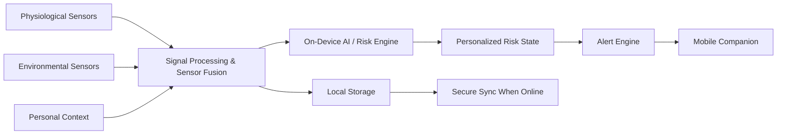

# JeevaFlux

### On-Device AI Personal Health Companion
**Smart India Hackathon 2026 — SIH26181**  
**Team: SYMBIONICS**  
**Theme: MedTech / BioTech / HealthTech**  
**Category: Hardware**

JeevaFlux is a proposed secure, AI-powered personal health companion designed for
real-time, privacy-preserving health monitoring and early-warning support. The
system combines physiological signals, environmental conditions and personal
context, with on-device intelligence intended to keep core monitoring useful even
when connectivity is unavailable.

> **Project status:** Prototype / research-stage system. Features and performance
> claims should be treated as validated only after the corresponding experiments
> are completed.

## Why JeevaFlux?

Health risks can develop from the interaction of a person's physiological state,
environmental exposure and activity. JeevaFlux is designed to detect meaningful
changes early and turn them into understandable, actionable warnings.

### Core ideas

- 🫀 Physiological monitoring
- 🌡️ Environmental monitoring
- 🧠 On-device AI and lightweight inference
- 🔗 Multimodal sensor fusion
- 👤 Personalized baseline and risk assessment
- 📱 Mobile companion
- 📴 Offline-first operation
- 🔐 Privacy-by-design
- 🚨 Early-warning workflows

## High-Level Flow



## Supported / Proposed Risk Areas

- Heat / heat-stress risk
- Possible dehydration / physiological strain
- Pollution / respiratory-risk awareness
- Abnormal vital-sign patterns
- Fatigue / poor recovery
- Fall / distress support

These are early-warning functions, **not medical diagnoses**.

## Repository

```text
JeevaFlux/
├── README.md
├── LICENSE
├── CITATION.cff
├── CHANGELOG.md
├── CONTRIBUTING.md
├── SECURITY.md
├── CODE_OF_CONDUCT.md
├── .gitignore
├── docs/
│   ├── architecture/
│   ├── requirements/
│   ├── research/
│   ├── deployment/
│   └── media/
├── assets/
│   ├── diagrams/
│   ├── slides/
│   └── screenshots/
├── src/
├── tests/
└── data/
```

## Documentation

- [Project Overview](docs/PROJECT_OVERVIEW.md)
- [Problem Statement](docs/PROBLEM_STATEMENT.md)
- [System Architecture](docs/architecture/SYSTEM_ARCHITECTURE.md)
- [System Flow](docs/architecture/SYSTEM_FLOW.md)
- [Sensor & Data Pipeline](docs/architecture/SENSOR_DATA_PIPELINE.md)
- [Privacy Architecture](docs/architecture/PRIVACY_ARCHITECTURE.md)
- [Software Requirements Specification](docs/requirements/SRS.md)
- [Functional Requirements](docs/requirements/FUNCTIONAL_REQUIREMENTS.md)
- [Non-Functional Requirements](docs/requirements/NON_FUNCTIONAL_REQUIREMENTS.md)
- [Data Model](docs/requirements/DATA_MODEL.md)
- [Research Plan](docs/research/RESEARCH_PLAN.md)
- [3-Month Roadmap](docs/research/3_MONTH_ROADMAP.md)
- [Validation Plan](docs/research/VALIDATION_PLAN.md)
- [Market Readiness](docs/deployment/MARKET_READINESS.md)
- [Deployment Strategy](docs/deployment/DEPLOYMENT_STRATEGY.md)
- [Risk Register](docs/deployment/RISK_REGISTER.md)
- [Future Scope](docs/deployment/FUTURE_SCOPE.md)
- [Demo Script](docs/media/DEMO_SCRIPT.md)
- [Portfolio Content](docs/media/PORTFOLIO_CONTENT.md)

## Disclaimer

JeevaFlux is a project/research prototype. It should not be represented as a
clinically validated diagnostic or emergency medical device unless and until
the appropriate validation, regulatory and clinical requirements have been met.
