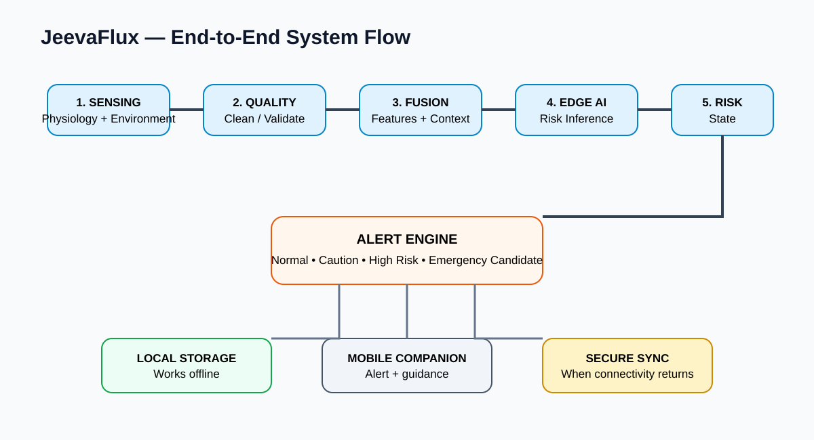
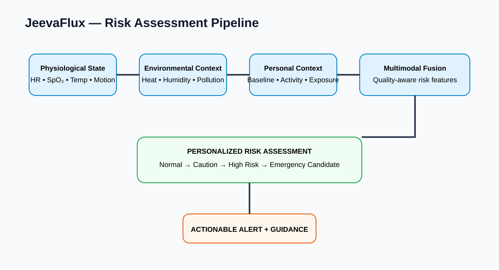
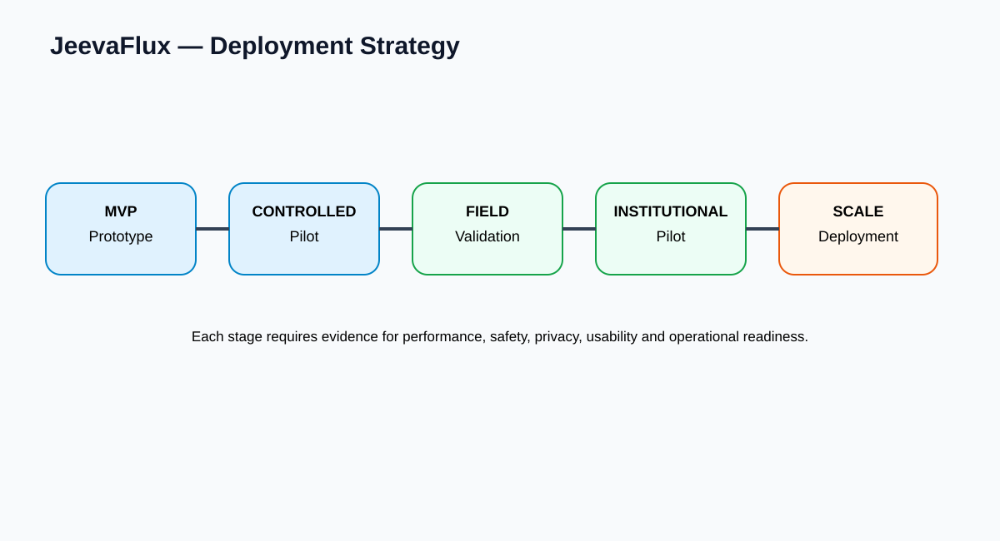

# GitHub Portfolio Page — JeevaFlux

## JeevaFlux
**On-Device AI Personal Health Companion**

> Continuous, contextual and privacy-preserving early-warning support.

### The Challenge

JeevaFlux addresses the SIH26181 challenge of building a secure personal health
companion that can monitor users in real time, preserve privacy, operate through
connectivity limitations and improve resilience during heat waves, floods,
pollution events and other disasters.

### The Idea

Instead of treating each sensor independently, JeevaFlux combines:

**Physiology + Environment + Personal Context**

to estimate a more meaningful personalized risk state.

### Architecture

### End-to-End Flow

### Key Engineering Ideas

| Idea | Why it matters |
|---|---|
| On-device AI | Low-latency local inference |
| Sensor fusion | Contextual interpretation of multiple signals |
| Personal baseline | User-specific reference |
| Offline-first | Resilience during connectivity loss |
| Privacy-by-design | Minimize exposure of sensitive health data |
| Actionable alerts | Turn risk estimates into understandable guidance |

### Risk Pipeline

### Deployment Path

### Status

**Prototype / research-stage**

The next engineering priorities are sensor validation, edge-model benchmarking,
personalization, offline reliability, controlled validation and field-pilot
preparation.

### Team

**SYMBIONICS**  
Smart India Hackathon 2026  
SIH26181
