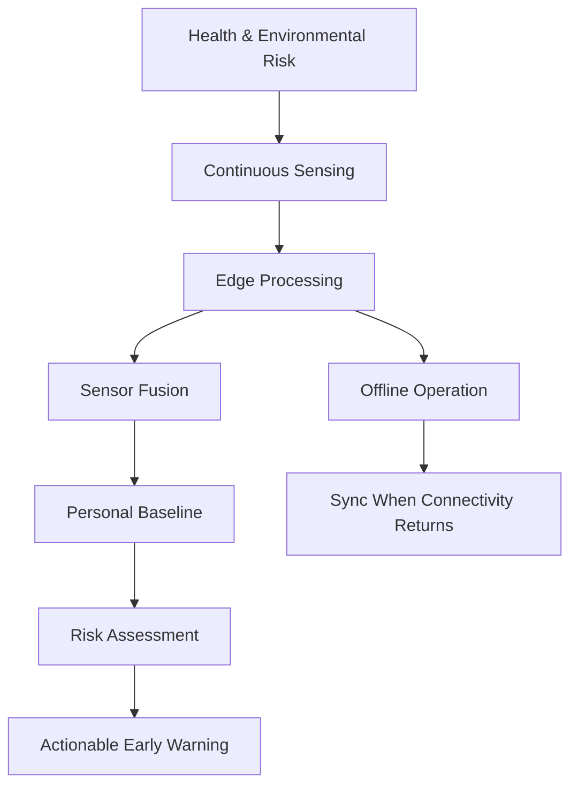

# Problem Statement

## SIH26181

> A secure, AI-powered Personal Health Companion that delivers real-time,
> privacy-preserving health monitoring and early warning capabilities, helping
> individuals recognize health risks before they become emergencies. The
> solution should improve resilience during heat waves, floods, pollution
> events, and other disasters common in India while enabling continuous health
> support through on-device intelligence.

## Problem Areas

### Delayed awareness
A person may not recognize a deteriorating physiological state until symptoms
become significant.

### Environmental exposure
Heat, humidity and air pollution can change the context in which physiological
measurements should be interpreted.

### Connectivity
Disaster and rural environments may have unreliable or absent connectivity.

### Privacy
Health information is sensitive; unnecessary transfer of raw data creates
additional privacy exposure.

### Fragmented signals
Single measurements can be noisy or ambiguous. JeevaFlux therefore emphasizes
multimodal context and sensor fusion.

## JeevaFlux Response

