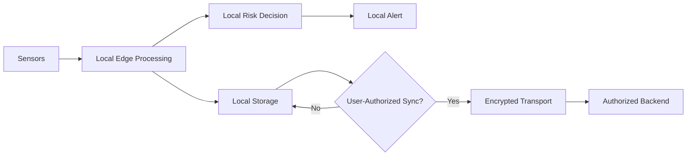

# Privacy Architecture

## Privacy-by-Design Goals

1. Minimize collection.
2. Prefer local processing.
3. Keep raw sensitive data local where practical.
4. Make optional sharing consent-based.
5. Encrypt authorized synchronization.
6. Maintain auditable access and retention policies.

## Data Path

## Threat Areas

- Unauthorized device access
- Mobile application compromise
- Insecure synchronization
- Excessive data retention
- Unauthorized institutional access
- Re-identification from aggregated datasets

## Required Controls

- Authentication
- Secure transport
- Least-privilege access
- Consent management
- Retention/deletion policy
- Audit logging
- Model/data versioning
- Secure device provisioning

## Important Boundary

Privacy architecture describes the intended design. Security certification or
formal compliance should not be claimed until the relevant assessment has been
performed.
