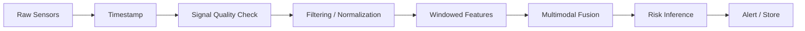

# Sensor & Data Pipeline

## Input Categories

### Physiological

- Heart rate
- SpO₂
- Skin temperature
- Activity / motion
- Sleep / recovery indicators
- GSR where implemented

### Environmental

- Temperature
- Humidity
- PM2.5 / PM10
- Air-quality indicators

### Context

- Personal baseline
- Activity level
- Exposure duration
- User-selected vulnerability/context information

## Pipeline

## Data Quality Rules

The implementation should define explicit behavior for:

- Missing values
- Sensor dropout
- Motion artifacts
- Physiologically implausible readings
- Environmental sensor failure
- Clock/timestamp inconsistencies
- Battery-related degradation

## Principle

No single noisy measurement should automatically be interpreted as a severe
health state without appropriate context and validation.
