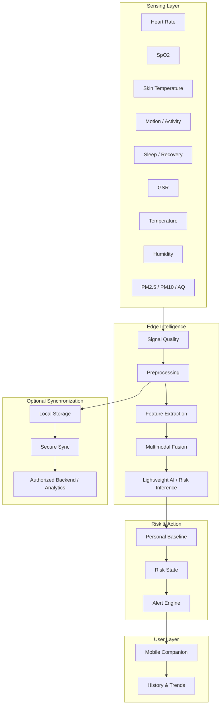

# System Architecture

## Architecture Overview

JeevaFlux can be represented as a layered architecture:

## Layer Responsibilities

| Layer | Responsibility |
|---|---|
| Sensing | Acquire physiological and environmental measurements |
| Signal Quality | Identify missing/unreliable/noisy measurements |
| Processing | Filtering, normalization and feature generation |
| Fusion | Combine complementary signals and context |
| AI | Lightweight local inference / anomaly and risk assessment |
| Personalization | Compare with user-specific baseline |
| Alerts | Convert risk into understandable action-oriented notifications |
| Mobile | User interaction, trends, status and history |
| Local Storage | Offline event retention |
| Sync | Optional secure synchronization after reconnection |

## Design Principle

The architecture separates **time-critical local functions** from optional
cloud functions. This supports the project's offline-first and privacy-first
goals.
