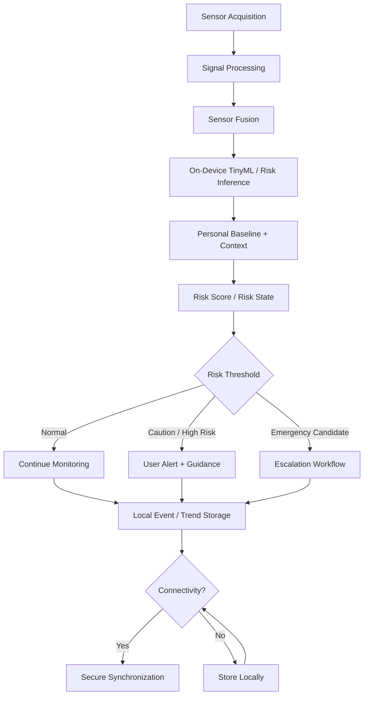

# JeevaFlux System Flow

## Processing Sequence

1. Acquire measurements.
2. Check signal quality.
3. Preprocess and extract features.
4. Fuse physiological, environmental and contextual signals.
5. Compare against personal baseline.
6. Estimate risk.
7. Generate a graded warning when appropriate.
8. Store the event locally.
9. Synchronize permitted records when connectivity returns.
