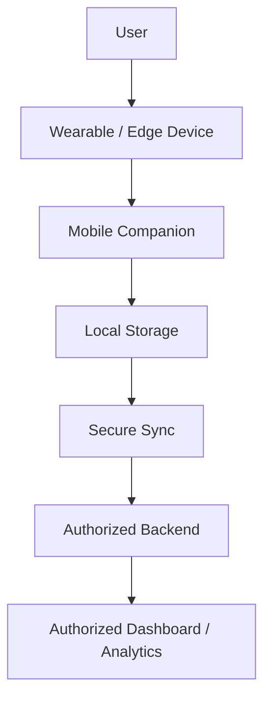

# Deployment Strategy

## Stage 1 — MVP / Prototype

Validate the complete sensing → edge AI → mobile flow.

## Stage 2 — Controlled Pilot

Test with representative users and controlled environmental/physiological
scenarios.

## Stage 3 — Field Validation

Evaluate real-world wearability, environmental variability, connectivity loss,
battery behavior and user response.

## Stage 4 — Institutional Pilot

Partner with an appropriate organization after safety, privacy and validation
requirements are established.

## Stage 5 — Scale

Introduce device provisioning, fleet management, secure analytics, support and
model/firmware version management.

## Deployment Architecture

