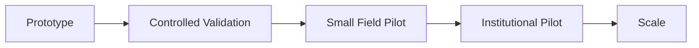

# Market Readiness

## Positioning

JeevaFlux is positioned as a privacy-preserving personal health companion for
early-warning support, with particular relevance to environmental and disaster
conditions.

## Target Segments

- Outdoor workers
- Elderly citizens
- Pollution-sensitive populations
- Rural / low-connectivity communities
- Disaster-prone populations
- Institutional/public-health pilots

## Deployment Advantages

- Edge-first processing
- Offline-first operation
- Modular sensor architecture
- Mobile companion
- Optional secure synchronization
- Personalized risk context

## Economic Planning

The project presentation includes indicative hardware-cost and pricing targets.
These should be treated as **project estimates**, not verified production
costs, until supplier quotations, manufacturing and certification costs are
validated.

## Readiness Gates

## KPIs

- Warning lead time
- Sensitivity/specificity
- False alerts per user-day
- Battery duration
- Sensor uptime
- Offline availability
- User adherence
- Alert comprehension
- Cost per deployed device
