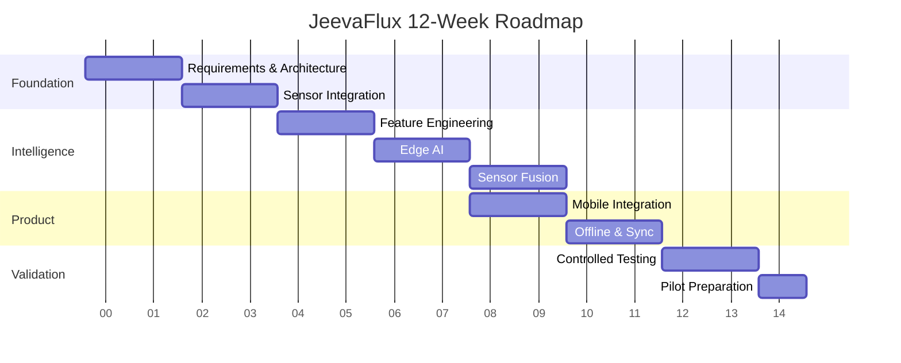

# 3-Month Research & Development Roadmap

## Month 1 — Foundation & Core Sensing

### Weeks 1–2
- Requirements and architecture
- Sensor selection/integration
- Data schema

### Weeks 3–4
- Signal quality
- Preprocessing
- Initial baseline data collection

## Month 2 — AI, Fusion & Mobile

### Weeks 5–6
- Feature engineering
- Lightweight edge inference

### Weeks 7–8
- Multimodal sensor fusion
- Personal baseline
- Mobile companion integration

## Month 3 — Resilience & Validation

### Weeks 9–10
- Offline-first behavior
- Local storage
- Secure synchronization

### Weeks 11–12
- Controlled validation
- Power/latency measurement
- Pilot preparation
- Documentation

*The dates above are illustrative for a 12-week cycle; adapt them to the team's
actual project calendar.*
